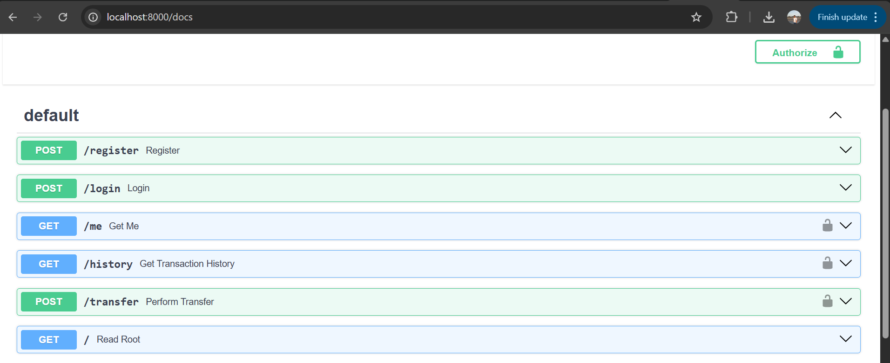
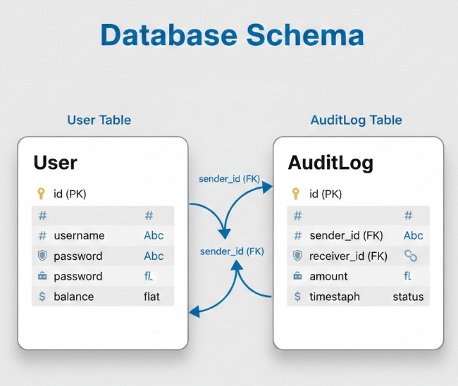

Peer2Paisa is a secure peer-to-peer money transfer system.

The application enables authenticated users to transfer funds securely while ensuring **atomic database transactions** and maintaining an **immutable audit log** for all transfers.

The system demonstrates:
- Secure JWT-based authentication
- Transaction atomicity using database sessions
- Audit logging for traceability
- Real-time frontend updates after transactions

## 📘 Assignment Scope Coverage

This project fully implements Real-time Transaction & Audit Log System as per the problem statement.

### Backend
- POST `/transfer` with atomic debit-credit transaction
- Dedicated audit log table storing immutable transaction records
- Authenticated endpoint to fetch transaction history
- JWT-based authentication for all protected routes

### Frontend
- Transfer form for sending money
- Real-time balance update after transfer
- Transaction history displayed in a table format


## 🛠 Tech Stack
**Backend:** FastAPI, SQLAlchemy, SQLite
**Frontend:** React 
**Auth:** JWT  
**AI Tools Used:** ChatGPT, Grok, Claude

---

## ⚙️ Setup & Run Instructions

### Clone Repository
```bash
git clone https://github.com/your-username/LenDenCLub_AuditLog.git
cd lenden


###  Backend Setup
cd backend
python -m venv venv
source venv/bin/activate   # Windows: venv\Scripts\activate
pip install -r py_requirements.txt

### Create .env file

SECRET_KEY= your_secret_JWT_key

### Run backend
uvicorn main:app --reload

### Frontend Setup

cd frontend
npm install
npm run dev


# backend apis



---

## 🔹 API Documentation (MANDATORY)

```md
## 🔌 API Documentation

### Authentication APIs
| Method | Endpoint | Description |
|------|---------|-------------|
| POST | /register | Register new user |
| POST | /login | Login and receive JWT |

### User APIs
| Method | Endpoint | Description |
|------|---------|-------------|
| GET | /me | Fetch logged-in user details |

### Transaction APIs
| Method | Endpoint | Description |
|------|---------|-------------|
| POST | /transfer | Transfer funds between users (atomic transaction) |
| GET | /history | Fetch transaction history for logged-in user |

Swagger UI available at: `http://localhost:8000/docs`


## 🗄 Database Schema


### User Table
| Field | Type | Description |
|-----|-----|------------|
| id | Integer (PK) | Unique user ID |
| username | String | Unique username |
| password | String | Hashed password |
| balance | Float | Current wallet balance |

### AuditLog Table
| Field | Type | Description |
|-----|-----|------------|
| id | Integer (PK) | Log ID |
| sender_id | Integer (FK) | Sender user ID |
| receiver_id | Integer (FK) | Receiver user ID |
| amount | Float | Transferred amount |
| timestamp | DateTime | Transaction time |
| status | String | SUCCESS / FAILED |


## 🤖 AI Tool Usage Log

### AI Tools Used
- ChatGPT
- Claude
- Grok

### AI-Assisted Tasks
- Generated FastAPI authentication boilerplate
- Helped implement SQLAlchemy database transactions for `/transfer`
- Debugged JWT authorization issues
- Helped structure README documentation
- Assisted in frontend design and state update logic after transfer

### Effectiveness Score
**Score: 4 / 5**

**Justification:**  
AI tools significantly reduced development time by generating boilerplate code and suggesting best practices for transactions and JWT security. Some manual debugging was still required for transaction edge cases and frontend synchronization.


### Audit Log

The audit log can be viewed as an whole for all the transactions amde on ht esystem by using the view_audit_log.py file  by running the following command on terminal

python view_audit_log.py
